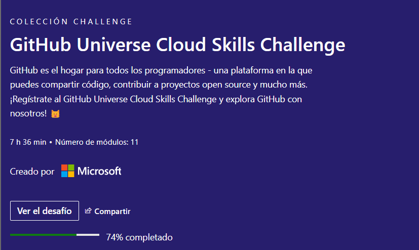

## Rock, Paper and Scissors Game

# This is a simple game of rock, paper and scissors made in python. Created in 5 minutes with github copilot.

This example is a simple example of how github copilot can help you in your projects and save you time.

This is a test of Microsoft skills challenge 2023.

# mini-game-in-5-minutes
